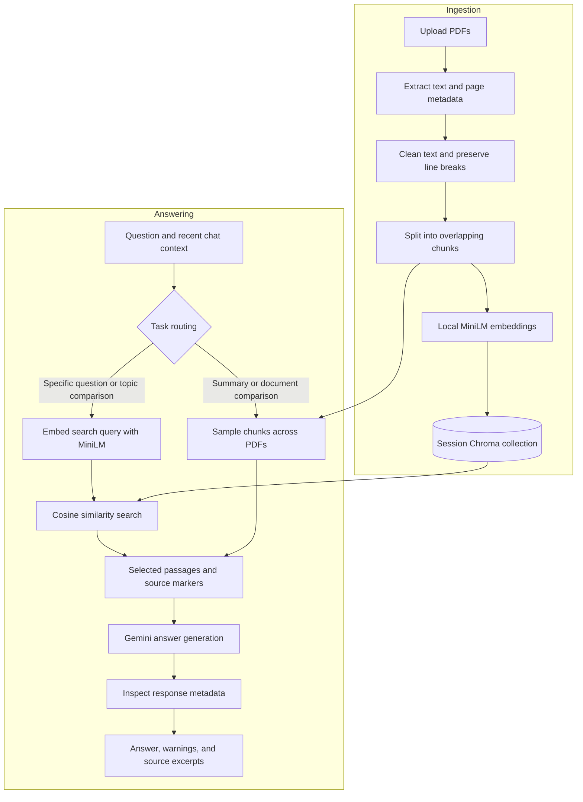

# DocLens

### Document Q&A with local embeddings and cited answers

DocLens is a multi-PDF study assistant built to explore the foundations of
Retrieval-Augmented Generation (RAG). Upload text-based PDFs, ask questions,
summarize their contents, and compare documents with inspectable source passages.

**Status: Stage 1 — Basic RAG foundation in progress.** The pipeline is implemented
and component checks pass. A 30-question real-PDF evaluation found issues; final
answer-quality and Cloud validation are still pending. See the
[validation report](evaluations/stage1-retest.md). This is a learning and portfolio project, not a
production-ready service.

[Live test app](https://doclens-rag.streamlit.app/) — verify important claims
against the retrieved excerpts. Do not use this demo for sensitive documents.

[Architecture](#architecture) · [Quick start](#quick-start) ·
[Testing](#testing-and-evaluation) · [Deployment](#deployment) · [Roadmap](#roadmap)

## What it does

- Accepts multiple text-based PDFs in one session.
- Builds semantic embeddings locally, without an embedding API key.
- Searches a separate Chroma collection for each upload set.
- Generates answers with filename-and-page citation instructions.
- Streams answers as they arrive; a bounded regeneration replaces truncated output.
- Exposes retrieved passages so users can inspect the evidence.
- Supports summaries, main topics, takeaways, comparisons, and follow-up questions.
- Retains generation finish reasons and token usage, with a bounded retry for
  empty or token-limited responses.
- Includes an optional TF-IDF baseline for retrieval experiments.

## Architecture

DocLens separates document ingestion from question answering. The same embedding
model encodes both document chunks and search questions.



**Specific questions and topic comparisons** retrieve up to 10 passages through semantic similarity.
**Summaries and document comparisons** currently use balanced sampling across documents,
capped at 60 and 24 chunks respectively. Sampling is an overview strategy and may
miss details in long documents.

A token-limit response or an empty response with a STOP/UNKNOWN finish reason
triggers one application-level retry requesting a shorter answer. Safety-blocked
responses are not retried. Provider transport retries are separate.

## Technology

| Component | Implementation |
| --- | --- |
| Interface | Streamlit |
| Extraction | PyPDFLoader / pypdf |
| Chunking | RecursiveCharacterTextSplitter: 1,200 characters, 200 overlap |
| Embeddings | all-MiniLM-L6-v2 through ONNX Runtime on CPU; 384 dimensions |
| Vector search | ChromaDB with cosine distance |
| Generation | Gemini through LangChain; model configurable |
| Testing | unittest, generated PDF fixture, Chroma integration checks |
| Automation | GitHub Actions runs the offline test suite |

Local embeddings remove external **embedding** quotas. Answer generation still
uses the Gemini API and its quotas.

## Quick start

Use Python 3.12 and Git. Internet access is needed to install dependencies,
download MiniLM on first use, and call Gemini.

### 1. Clone the working branch

```bash
git clone --branch feat/basic-rag-foundation https://github.com/Mann-Raval/doclens-rag.git
cd doclens-rag
python -m venv venv
```

Activate the environment:

```powershell
# Windows PowerShell
.\venv\Scripts\Activate.ps1
```

```bash
# macOS / Linux
source venv/bin/activate
```

### 2. Install and configure

```bash
python -m pip install -r requirements.txt
```

Create a `.env` file in the repository root:

```dotenv
GOOGLE_API_KEY=your_gemini_api_key
GEMINI_CHAT_MODEL=gemini-3.5-flash-lite
RETRIEVAL_BACKEND=semantic
```

Only the API key is required; the other values are defaults. Set
`RETRIEVAL_BACKEND=lexical` to run the TF-IDF baseline. No Groq key is needed.

### 3. Run

```bash
python -m streamlit run app.py
```

Open the local URL printed in the terminal. Upload PDFs and try:

- “Explain the difference between TCP and UDP using these documents.”
- “Summarize each uploaded PDF.”
- “Compare the topics covered by these chapters.”

First indexing takes longer while the embedding model downloads. Subsequent
indexing uses cached model weights; unchanged uploads reuse the session index.

## Project layout

```text
doclens-rag/
├── app.py                     # Streamlit interface
├── rag.py                     # Compatibility entry point
├── src/pdf_rag/
│   ├── config.py              # Pipeline limits
│   ├── embeddings.py          # Shared local MiniLM model
│   ├── ingestion.py           # Parsing, chunking, chunk identifiers
│   ├── retrieval.py           # Chroma search and lexical baseline
│   ├── generation.py          # Gemini prompt and response metadata
│   ├── pipeline.py            # Routing, context, retries, evidence
│   └── schemas.py             # Shared answer structure
├── tests/                     # Offline unit and integration tests
├── evaluations/               # Evaluation protocol and semantic smoke check
├── docs/                      # Architecture, deployment, milestone plan
├── .github/workflows/         # Automated tests
├── .streamlit/config.toml     # Upload configuration
└── requirements.txt
```

## Storage and data flow

| Data | Where it lives | Lifetime |
| --- | --- | --- |
| Uploaded PDF bytes | Streamlit server memory | While retained by the session |
| Parsing files | Server temporary directory | Removed after processing, including on failure |
| Text, metadata, and vectors | Session-owned ephemeral Chroma collection and Python objects | Reused within the session; lost on server restart |
| Embedding model weights | Server model cache on disk | Reused while the cache exists |
| Conversation | Streamlit session state | Until cleared or the session is discarded |

Replacing or removing PDFs deletes their active collection. Abandoned collections
are also scheduled for cleanup when the index object is garbage-collected;
disconnecting a browser does not guarantee immediate deletion.

**Local embeddings do not mean fully local processing:** selected passages and
recent conversation text are sent to Gemini for answer generation. API keys,
private uploads, and model weights should not be committed to Git.

## Testing and evaluation

Run the offline checks:

```bash
python -m unittest discover -s tests -v
```

Run a real local-embedding smoke check:

```bash
python -m evaluations.semantic_smoke
```

The second command downloads MiniLM if necessary but makes no Gemini calls.

Verified during development:

- 69 automated tests passed, including generated-PDF ingestion, Chroma collection
  isolation, upload/session lifecycle, streaming, retry limits, citation-marker
  warnings, and response metadata handling.
- Real MiniLM retrieval matched a question about a “doctor” to a “physician” passage.
- The Streamlit startup screen rendered successfully.
- Two 30-question live runs and six targeted retests completed. Remaining
  cross-document attribution issues are documented in the
  [results and release blockers](evaluations/stage1-retest.md).

These checks establish component behavior, **not overall answer accuracy**.
A reviewed real-document benchmark is still required. See the
[evaluation protocol](evaluations/README.md).

## Deployment

For Streamlit Community Cloud, select:

| Setting | Value |
| --- | --- |
| Repository | Mann-Raval/doclens-rag |
| Branch | feat/basic-rag-foundation |
| Entry point | app.py |
| Python | 3.12 |

Add `GOOGLE_API_KEY` in Streamlit's Secrets settings as a top-level TOML value.
Do not add the key to GitHub. See the [deployment guide](docs/deployment.md).

Community Cloud has shared resource limits and does not guarantee local-file
persistence. This design rebuilds indexes after a restart; it does not provide
permanent document libraries. See the official
[resource documentation](https://docs.streamlit.io/deploy/streamlit-community-cloud/manage-your-app)
and [storage guidance](https://docs.streamlit.io/develop/concepts/connections/connecting-to-data).

## Current limits

- Up to 5 PDFs, 20 MB combined, and 500 pages per upload set.
- Text-based PDFs only; OCR and reliable diagram/table extraction are not implemented.
- Citations are generated by the model; their factual support is not automatically verified.
- MiniLM's input window can truncate long passages; chunk sizing still needs evaluation.
- Sampled summaries may omit sections.
- No user accounts, durable libraries, or application-level per-user rate limiting.
- Resource and answer-quality checks on Community Cloud are still pending.

## Roadmap

**Stage 1 — Basic RAG**

- [x] Modular ingestion, local embeddings, Chroma retrieval, and generation
- [x] Multiple PDFs, source excerpts, and generation diagnostics
- [x] Offline tests and a real semantic retrieval smoke check
- [ ] Reproduce and resolve incomplete comparisons on real PDFs
- [ ] Evaluate approximately 30 questions, including unsupported questions
- [ ] Validate citations, answer completeness, latency, and resource usage
- [ ] Verify full upload/chat lifecycle and concurrent sessions
- [ ] Validate deployment, merge the feature branch, and release v1.0

**Later phases**

- Hybrid retrieval and optional reranking, evaluated against the basic baseline.
- FastAPI backend and a separate frontend.
- Bounded corrective or agentic workflows where evaluation shows a benefit.

See the [detailed milestone plan](docs/roadmap.md) and
[architecture notes](docs/architecture.md).
